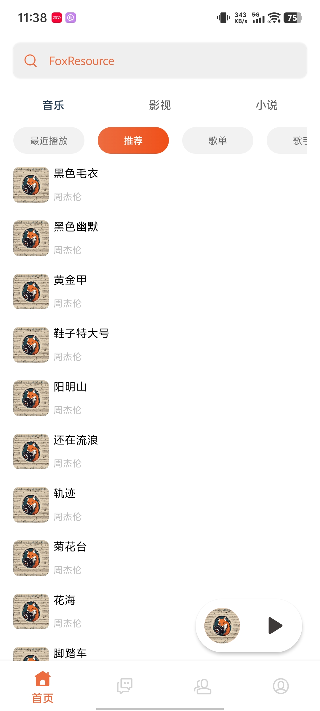
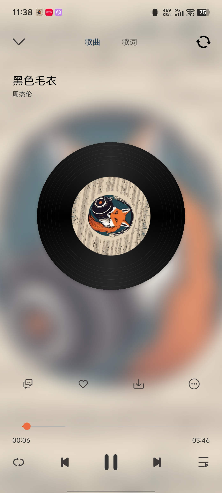
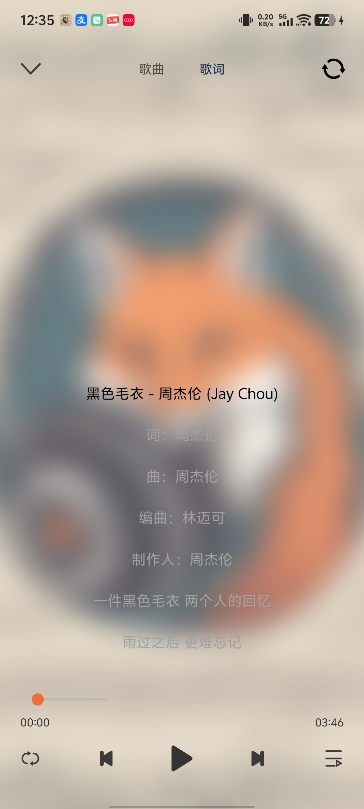
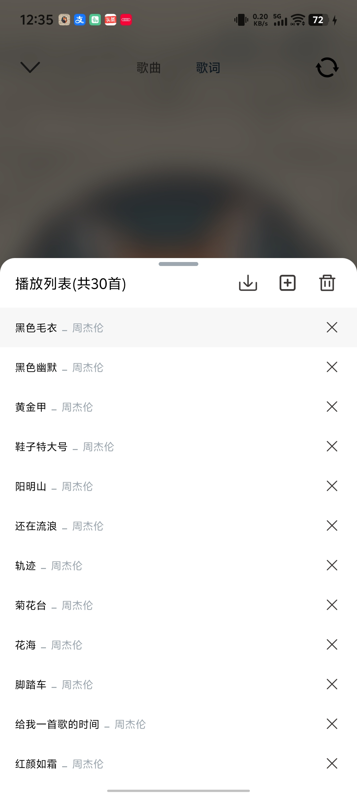

FoxResource是使用mvvm框架，使用组件化与ARouter实现
使用技术包含Retrofit、Okhttp、Glide、Lottie等
使用androidx.media3媒体库与Exoplayer实现音视频播放，videocache实现缓存与断点续传

配套后端与后台管理前端均由本人编写，资源仅限学习交流，请勿传播

接口文档：https://apifox.com/apidoc/shared-6e9d5a14-a561-42a5-b40b-7129974d0489

[apk文件](readme/app-debug.apk)

